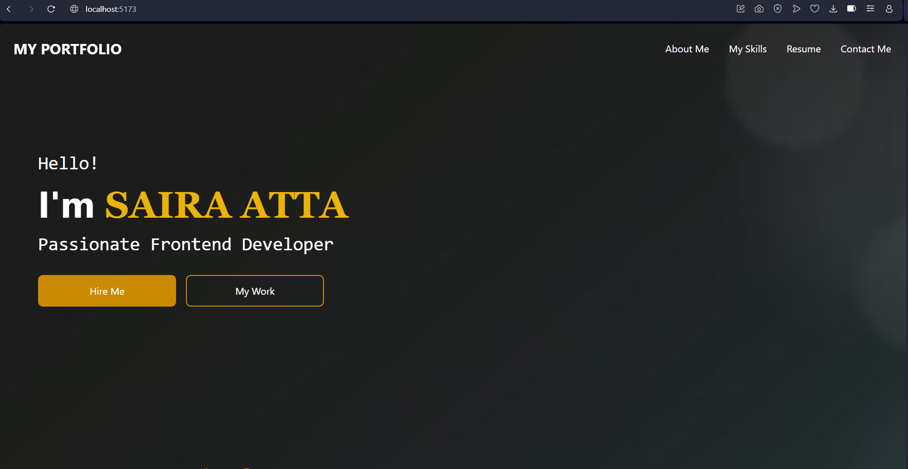
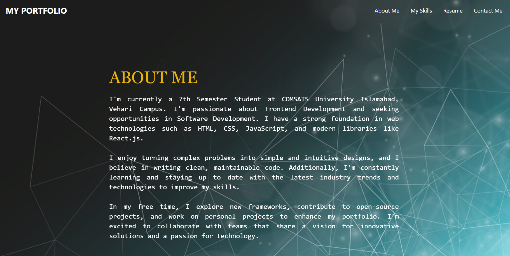

# My Portfolio Website


## Description
This is a responsive personal portfolio website built using **React.js (Vite)** and **TailwindCSS**. It includes various sections such as Home, About Me, Resume, Skills, and Contact Me. The website features a navbar and footer that are consistent across all pages. It is fully responsive and optimized for different screen sizes.

## Features
- Responsive design for all devices (mobile, tablet, desktop)
- **Home Page**: Intro and call-to-action buttons.
- **About Me Page**: Information about myself, including a brief bio.
- **Resume Page**: A downloadable resume and sections for experience and education.
- **Skills Page**: Display of technical and soft skills using icons and progress bars.
- **Contact Me Page**: A contact form where visitors can send messages.
- Navbar and Footer are persistent across all pages.


## Screenshots




## Technologies Used
- **React.js (Vite)**: For building the front-end of the website.
- **Tailwind CSS**: For styling the website and making it responsive.
- **JavaScript (ES6+)**: The primary programming language.
- **HTML5 & CSS3**: For basic structure and additional styling.

## Installation

1. Clone the repository to your local machine:
   ```bash
   git clone https://github.com/sairaatta/Portfolio-Website.git
2. Navigate into the project directory:
   ```bash
   cd portfolio-website
3.Install the required dependencies:
  ```bash
    npm install
  ```
4. Run the development server:
   ```bash
   npm run dev
The website will be live at http://localhost:5173/.


